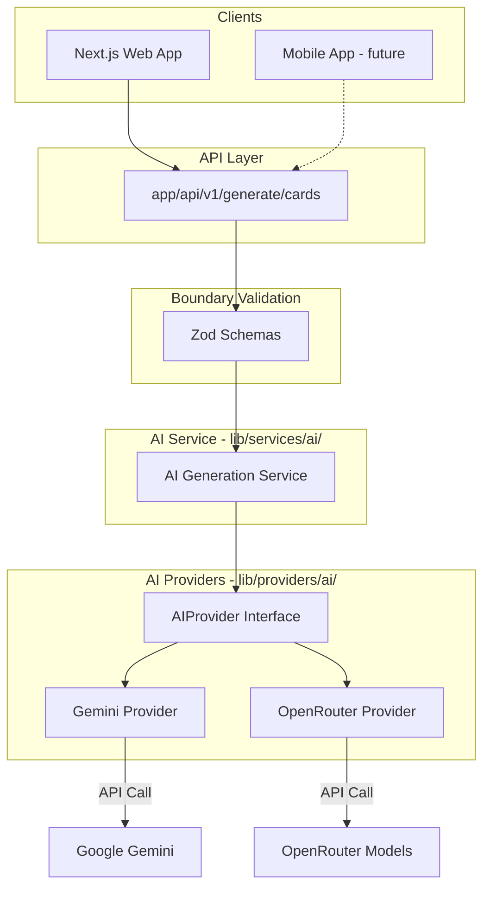
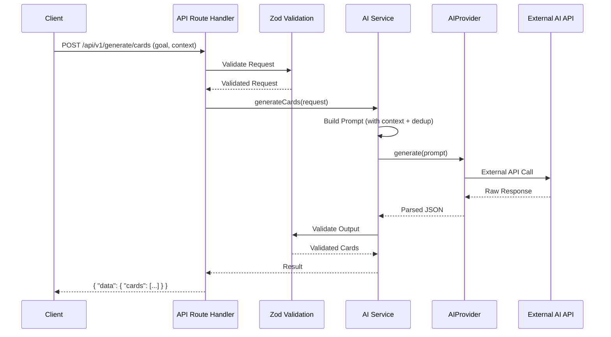

# 01 — AI Service Architecture

## System Diagram



---

## Layer Responsibilities

| Layer | Location | Responsibility |
|-------|----------|----------------|
| **API Route Handler** | `src/app/api/v1/generate/` | HTTP boundary, Zod validation, call AI service |
| **AI Service** | `src/lib/services/ai/` | Orchestrate generation, manage context, dedup, retry |
| **AI Providers** | `src/lib/providers/ai/` | Gemini and OpenRouter implementations behind AIProvider interface |
| **AI Validators** | `src/lib/validators/ai/` | Zod schemas for generation request, card output, learner context |

---

## What Goes Where

| ✅ Belongs in | ❌ Never in |
|---------------|-------------|
| `lib/services/ai/` — generation orchestration, dedup logic, retry logic | Never import Gemini/OpenRouter SDK in services (go through provider interface) |
| `lib/providers/ai/` — Gemini SDK calls, OpenRouter HTTP calls | Never put AI logic in features/ or components/ |
| `lib/validators/ai/` — card schema, context schema, request schema | Never expose API keys to client |
| `app/api/v1/generate/` — HTTP boundary only | |

---

## Proposed Folder Structure

```text
src/
  app/api/v1/
    generate/
      cards/route.ts          # POST /api/v1/generate/cards
  lib/
    services/ai/
      ai-generation-service.ts  # Orchestration, dedup, retry
      types.ts                  # Service-level types
    providers/ai/
      ai-provider.ts           # AIProvider interface
      gemini-provider.ts       # Gemini implementation
      openrouter-provider.ts   # OpenRouter implementation
      provider-factory.ts      # Factory based on AI_PROVIDER env
    validators/ai/
      generation-request.ts    # Request validation
      card-schema.ts           # Generated card validation
      learner-context.ts       # Context validation
```

---

## Data Flow



---

## Integration with Existing Architecture

- The AI service is a new bounded context alongside decks, lessons, cards, review
- Cards generated by AI follow the same Card schema and can be imported into decks
- The scheduler remains completely AI-agnostic — it doesn't know or care how cards were created
- The AI API uses the same response envelope (`{ "data": T }` / `{ "error": ... }`) as all other endpoints

---

## Key Design Decisions

- Provider abstraction: swap Gemini for any provider without changing service logic
- Client-sent context in v1: no new DB tables needed initially
- API versioned at `/api/v1/` to allow future breaking changes
- Separate from main app versioning — AI features ship via developAI → mainAI branch
