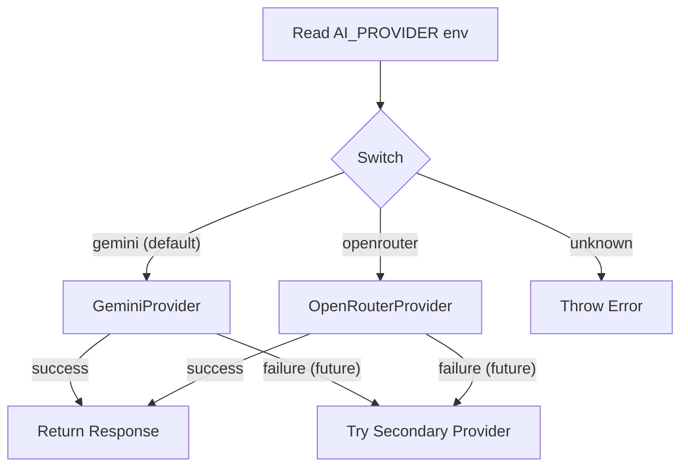

# 03 — Provider Abstraction

The AI service must not directly depend on any single AI provider. A provider interface allows swapping Gemini for OpenRouter (or any future provider) without changing the application API or service logic.

---

## AIProvider Interface

```typescript
// src/lib/providers/ai/ai-provider.ts

export interface GenerateCardsRequest {
  goal: string;
  topic: string;
  level: 'beginner' | 'intermediate' | 'advanced';
  batchSize: number;
  context: LearnerContext;
  systemPrompt: string;
}

export interface GenerateCardsResponse {
  cards: GeneratedCard[];
  usage?: {
    promptTokens?: number;
    completionTokens?: number;
    totalTokens?: number;
    model: string;
  };
}

export interface AIProvider {
  readonly name: string;
  generateCards(request: GenerateCardsRequest): Promise<GenerateCardsResponse>;
}
```

---

## Provider Implementations

### GeminiProvider
- Uses `@google/genai` SDK (Gemini API)
- Initial model: `gemini-3.6-flash` (free tier)
- Supports structured JSON output mode
- Environment: `GEMINI_API_KEY`

### OpenRouterProvider
- Uses OpenRouter HTTP API (REST, no SDK needed)
- Free models: `openrouter/free`, `google/gemma-4-31b-it:free`, etc.
- Requires explicit JSON parsing
- Environment: `OPENROUTER_API_KEY`

### OllamaCloudProvider
- Uses official Ollama Cloud API (`https://ollama.com/api/chat`)
- Native structured outputs via `"format": "json"`
- Free candidate models: `gemma4:31b` (default), `gpt-oss:120b`, `gpt-oss:20b`, `nemotron-3-nano:30b`, `nemotron-3-super`, `nemotron-3-ultra`
- Environment: `OLLAMA_API_KEY`, `OLLAMA_MODEL` (optional), `OLLAMA_BASE_URL` (optional)

---

## Provider Factory

```typescript
// src/lib/providers/ai/provider-factory.ts

export function createAIProvider(): AIProvider {
  const provider = process.env.AI_PROVIDER ?? 'gemini';
  
  switch (provider) {
    case 'gemini':
      return new GeminiProvider(options.geminiOptions);
    case 'openrouter':
      return new OpenRouterProvider(options.openrouterOptions);
    case 'ollama':
      return new OllamaCloudProvider(options.ollamaOptions);
    default:
      throw new Error(`Unknown AI provider: ${provider}`);
  }
}
```

---

## Environment Variables

| Variable | Required | Description |
|----------|----------|-------------|
| `AI_PROVIDER` | No (default: `gemini`) | Active provider: `gemini`, `openrouter`, or `ollama` |
| `GEMINI_API_KEY` | When AI_PROVIDER=gemini | Google AI API key |
| `OPENROUTER_API_KEY` | When AI_PROVIDER=openrouter | OpenRouter API key |
| `OLLAMA_API_KEY` | When AI_PROVIDER=ollama | Ollama Cloud API key |
| `OLLAMA_BASE_URL` | No (default: `https://ollama.com`) | Ollama server URL |
| `OLLAMA_MODEL` | No (default: `gemma4:31b`) | Ollama Cloud model |

---

## Adding a New Provider

1. Create `src/lib/providers/ai/new-provider.ts` implementing `AIProvider`
2. Add case to `provider-factory.ts`
3. Add env var documentation
4. No changes needed in the AI service, API route, or any UI code

---

## Provider Selection Diagram



---

## Design Decisions

| Decision | Rationale |
|----------|-----------|
| Interface, not abstract class | Keep it simple, no shared state |
| Factory function, not DI container | Appropriate for project scale |
| Optional usage tracking | Not all providers expose token counts |
| Provider-specific prompt tuning | Happens inside each provider, not in the service |
