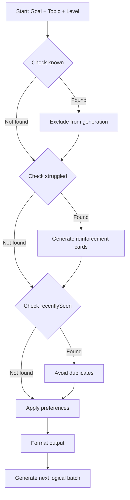
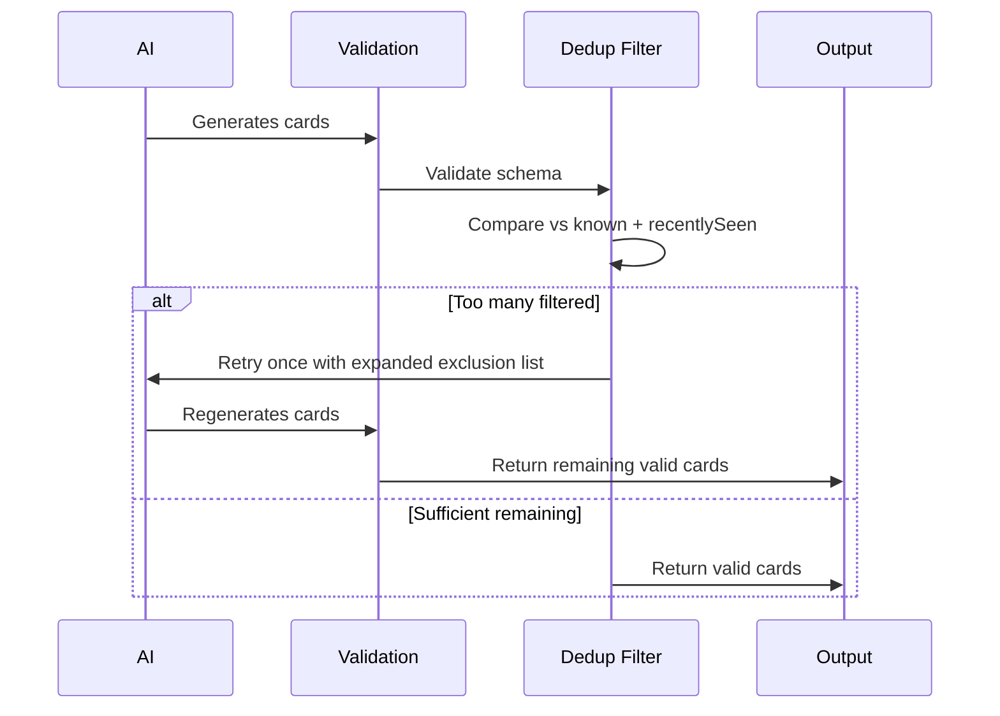

# 04 — Learner Context & Adaptive Generation

## Overview

The AI generates cards based on the learner's current state. The learner context is a compact representation of what the learner knows, struggles with, and has recently seen. In v1, the client sends context with each request. Future versions will persist context server-side.

---

## Context Schema

```typescript
// src/lib/validators/ai/learner-context.ts

export interface LearnerContext {
  known: string[];           // Concepts the learner already knows
  struggled: string[];       // Concepts the learner found difficult
  recentlySeen: string[];    // Recently generated content (for dedup)
  preferences: {
    romanization?: boolean;  // Include phonetic romanization
    examples?: boolean;      // Include usage examples
  };
}
```

## Context Example

```json
{
  "known": [
    "Namaskara",
    "Dhanyawada"
  ],
  "struggled": [
    "Hegiddira"
  ],
  "recentlySeen": [
    "Nimma hesaru enu?"
  ],
  "preferences": {
    "romanization": true,
    "examples": true
  }
}
```

---

## How Context Drives Generation



---

## Feedback Types

| Feedback | Effect on Context | AI Behavior |
|----------|-------------------|-------------|
| Known | Add to `known` | Skip in future batches |
| Easy | Add to `known` | Increase difficulty slightly |
| Good | No change | Continue current progression |
| Hard | Add to `struggled` | Generate reinforcement |
| Forgot | Add to `struggled`, remove from `known` | Re-teach concept |
| Not useful | Remove from generation pool | Avoid similar content |
| Already knew this | Add to `known` | Skip, adjust level assessment |

---

## Duplicate Avoidance

- **Prompt-level**: Include `recentlySeen` and `known` in the system prompt so the model avoids generating them
- **Post-generation validation**: Programmatic check comparing generated card fronts against `known` + `recentlySeen` using normalized string comparison
- **Why both**: Models sometimes ignore instructions; programmatic dedup is the safety net



---

## Context Size Limits

| Field | Max Items | Rationale |
|-------|-----------|-----------|
| known | 100 | Keep prompt size manageable |
| struggled | 50 | Focus on recent struggles |
| recentlySeen | 50 | Rolling window of recent content |
| Total context tokens | ~2000 | Stay within free-tier prompt limits |

---

## Context Evolution

- **v1 (current plan)**: Client sends full context with each request. No server-side persistence.
- **v2 (future)**: Server persists context per user per topic. Client sends only feedback; server updates context.
- **v3 (future)**: Server-side learning analytics, spaced repetition integration with AI-generated cards.

The API shape (`POST /api/v1/generate/cards` with context in body) supports both models without breaking changes.

---

## Design Decisions

- **Compact context over full history**: sending every card ever generated would blow up prompt tokens
- **Client-managed context in v1**: avoids new DB tables, lets us iterate quickly
- **Rolling window for recentlySeen**: FIFO, oldest items drop off when limit is hit
- **Feedback updates**: happen client-side in v1 (simple state management)
