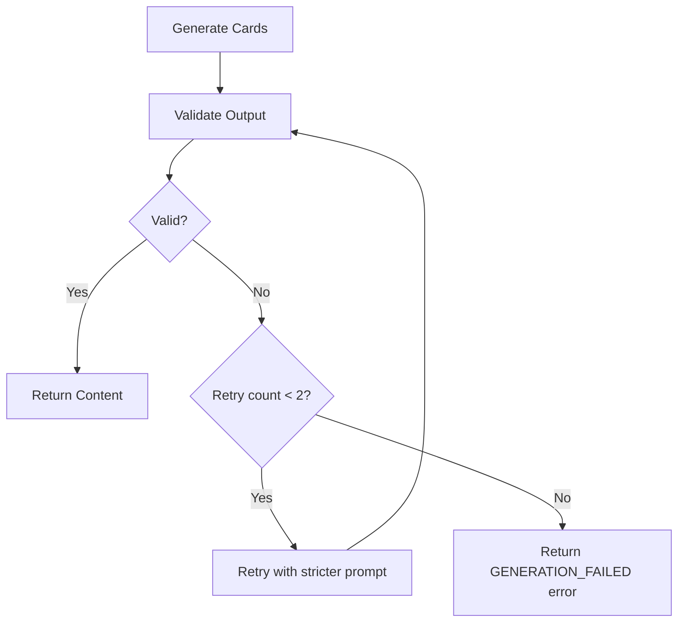
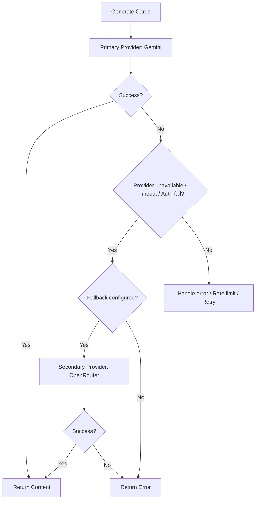

# 06 — Cost Control & Operational Limits

## Overview

The initial implementation assumes free-tier limits. All cost controls are designed to prevent runaway API usage while maintaining a good user experience. The application enforces aggressive limits to stay within the boundaries of our chosen free AI providers.

---

## Free Tier Limits

| Provider | Model | Free Tier Limit | Notes |
| :--- | :--- | :--- | :--- |
| Gemini | gemini-3.6-flash | 15 RPM, 1M TPD, 1500 RPD | Best free option for structured JSON |
| OpenRouter | Various free models | Model-dependent, typically ~20 RPM | Quality varies; test before committing |

*RPM = requests per minute, TPD = tokens per day, RPD = requests per day*

---

## Application-Level Limits

| Limit | Value | Rationale |
| :--- | :--- | :--- |
| Min batch size | 5 | Below this, generation isn't worth the API call |
| Max batch size | 25 | Keeps prompt + response within free-tier token limits |
| Default batch size | 10 | Good balance of content and cost |
| Max retries on invalid output | 2 | Prevent infinite retry loops |
| Request timeout | 30 seconds | Gemini free tier can be slow under load |
| Max context items (known) | 100 | Keep prompt size manageable |
| Max context items (struggled) | 50 | Focus on recent struggles |
| Max context items (recentlySeen) | 50 | Rolling dedup window |
| Rate limit per user | 10 requests/minute | Prevent abuse, stay within provider limits |
| Rate limit global | 12 requests/minute | Buffer below provider RPM limits |

---

## Rate Limiting Strategy

- Per-user rate limiting is enforced at the API route handler level.
- Global rate limiting is applied to stay below the provider's free-tier RPM limits.
- An in-memory rate limiter (simple token bucket) will be used initially.
- **Future:** Redis-based rate limiting for multi-instance deployments.
- Rate limit headers are returned in the response: `X-RateLimit-Remaining`, `Retry-After`.

---

## Retry Policy



- **On provider timeout:** No automatic retry (user can retry manually).
- **On rate limit from provider:** Return HTTP `429` to the client with a `Retry-After` header.
- **On auth failure:** No automatic retry, return HTTP `502`.

---

## Token Usage Logging

- Every generation request is logged with: provider, model, prompt tokens, completion tokens, timestamp, and userId.
- **v1:** Console logging (structured JSON logs).
- **Future:** Persist to DB for usage analytics and billing.

```json
{
  "timestamp": "2026-09-18T10:00:00Z",
  "level": "info",
  "event": "ai_generation_completed",
  "userId": "usr_12345",
  "provider": "gemini",
  "model": "gemini-3.6-flash",
  "usage": {
    "promptTokens": 6200,
    "completionTokens": 3800,
    "totalTokens": 10000
  },
  "durationMs": 4500
}
```

---

## Provider Fallback



- **Fallback triggers:** Provider unavailable, auth failure, timeout.
- **Fallback does NOT trigger on:** Rate limit (wait instead) or invalid output (retry same provider).
- **Environment config:** `AI_PROVIDER_FALLBACK=openrouter`

---

## Background Generation Rules

| Rule | Description |
| :--- | :--- |
| ✅ Belongs in | Pre-generating **ONE** next batch while the user studies current cards |
| ❌ Never in | Continuously generating without active user activity |

- Background generation uses the exact same rate limits as manual generation.
- If background generation fails, it does not block the current study session.

---

## Cost Projection

Based on ~10K tokens per generation request (prompt + response) with a batch size of 10.

| Scenario | Daily Requests | Estimated Tokens/Day | Within Free Tier? |
| :--- | :--- | :--- | :--- |
| Light user (2 sessions) | 4-6 | ~50K | ✅ Yes |
| Active user (5 sessions) | 10-15 | ~150K | ✅ Yes |
| Heavy user (10+ sessions) | 20-30 | ~300K | ✅ Yes |
| 10 concurrent users | 100-200 | ~2M | ⚠️ Near limit |
| 50 concurrent users | 500+ | ~5M+ | ❌ Needs paid tier |
