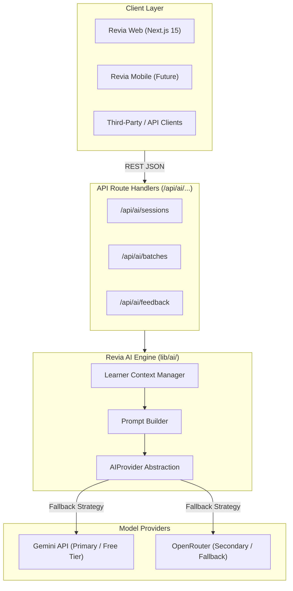

# Revia AI Learning Engine — Documentation

> **Active Development** — Independent adaptive learning engine that generates contextual spaced repetition cards.

---

## Overview

**Revia AI** is an independent AI learning engine that generates adaptive learning content. Given a user's learning goal, topic, current proficiency level, and past performance, it dynamically generates batches of high-quality learning cards rather than static, one-size-fits-all decks.

---

## Relationship to Revia Core

Revia AI is developed as an **independent service** decoupled from the Revia web UI:

* **API-First**: Exposes a uniform REST API (`/api/ai/...`) returning standardized `{ "data": T }` and `{ "error": { "code", "message" } }` envelopes.
* **Multi-Client Support**: Designed to serve Revia Web, upcoming Revia Mobile clients, and external integrations without UI-specific coupling.
* **Scheduler Agnostic**: Emits standard card structures that feed seamlessly into Revia's pure spaced repetition scheduler (`lib/scheduler`).

---

## Branching & Release Workflow

AI development is isolated from core application releases:

| Stream | Development Branch | Production Branch | Target Version |
|---|---|---|---|
| **Core App** | `develop` | `main` | v1.8.x stable |
| **Revia AI** | `developAI` | `mainAI` | AI feature stream |

> [!IMPORTANT]
> All AI feature branches, pull requests, and experiment work must target `developAI` and merge into `mainAI`. Do not commit AI engine changes directly to core `develop` or `main`.

---

## Documents

| Document | Description |
|---|---|
| [prd.md](./prd.md) | Product Requirements Document |
| [01-architecture.md](./01-architecture.md) | AI service architecture, system diagrams, folder structure |
| [02-api-reference.md](./02-api-reference.md) | API endpoints, request/response schemas, error handling |
| [03-provider-abstraction.md](./03-provider-abstraction.md) | AIProvider interface, Gemini/OpenRouter implementations |
| [04-learner-context.md](./04-learner-context.md) | Learner context schema, feedback types, duplicate avoidance |
| [05-progress-and-roadmap.md](./05-progress-and-roadmap.md) | AI feature phases and success criteria |
| [06-cost-and-limits.md](./06-cost-and-limits.md) | Free-tier limits, rate limiting, retry policy |

---

## Architectural Boundaries

| Layer / Concern | ✅ Belongs in Revia AI | ❌ Never in Revia AI |
|---|---|---|
| **API Endpoints** | REST JSON handlers validating input via Zod schemas | UI-specific state handling or HTML rendering |
| **Provider Layer** | Pluggable `AIProvider` implementations (Gemini, OpenRouter) | Hardcoded vendor SDK calls inside route handlers |
| **Learner Context** | Compact concept summaries, struggle tracking, deduplication lists | Full conversation histories or unpruned interaction logs |
| **Card Output** | Normalized front/back card data with optional hints/tags | Proprietary model markdown or unvalidated JSON strings |
| **Scheduling** | Producing raw cards formatted for spaced repetition | Custom review interval calculations (delegated to `lib/scheduler`) |

---

## Related Documentation

For broader context on the Revia application architecture and roadmap:

* [Architecture Overview](../architecture/01-overview.md) — System layers, API-first design, and mobile strategy
* [Technical Reference](../application/technical-reference.md) — Comprehensive technical reference for core Revia
* [Progress & Roadmap](../application/progress-and-roadmap.md) — Main application roadmap and release schedule
