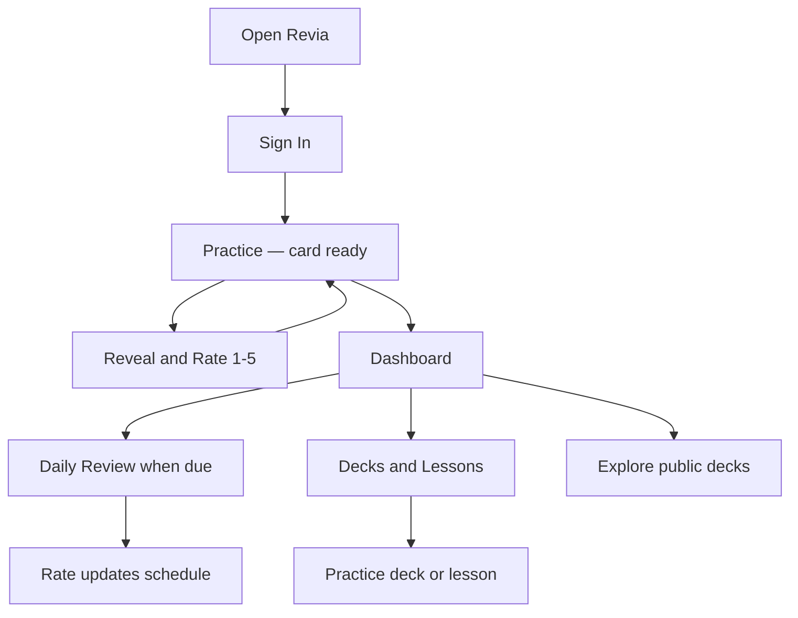
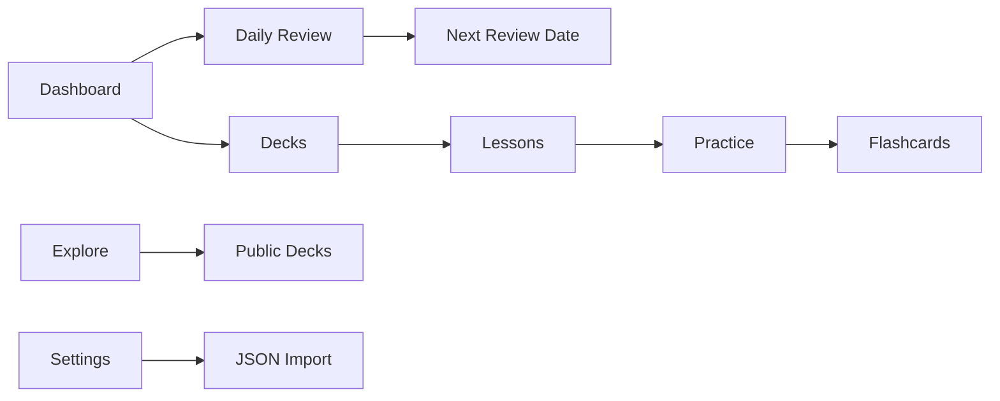

# Application Guide

## What This App Does

Revia is a mobile-first app for learning and remembering information with digital flashcards.

You organize study material into **decks**, split decks into **lessons**, and add **cards** with a front (question or prompt) and back (answer). The app helps you practice continuously and review due cards on a schedule.

Revia works for any subject — languages, exams, interview prep, professional knowledge, or anything that fits on a flashcard.

## Who This Is For

Personal learners who want a simple daily study habit on their phone:

- Students reviewing definitions or concepts
- Language learners practicing vocabulary
- Professionals keeping key facts fresh
- Anyone who prefers small, focused review sessions over long study blocks

You can keep decks private, publish them to **Explore**, or import public decks from other learners into your library.

## The Problem It Solves

Reading something once is not enough to remember it. Reviewing everything every day is tiring.

Revia gives you two modes:

- **Practice** — keep learning without running out of cards; harder cards come back sooner in the same session
- **Daily Review** — spaced repetition for long-term memory; only cards that are due today

## Main Things You Can Do

- **Sign up and sign in** with email, username, or password
- **Practice immediately** when you open the app — a card is ready to go
- **View your dashboard** — cards due today, streak, decks, Daily Review shortcut
- **Create and manage decks** — topic containers with color and subject
- **Add lessons** and **practice** them (all deck cards or one lesson at a time)
- **Run Daily Review** — rate each due card 1–5; scheduling updates for next time
- **Explore public decks** — browse, import to your library, author stays credited
- **Import decks** from JSON (upload or paste, then click Import JSON) in Settings
- **Search** your library and public decks in Explore
- **Send feedback** (suggestions and bugs) in Settings
- **Switch theme** (light/dark) and manage account in Settings

## How The App Works

Three levels of organization:

1. **Deck** — big topic (e.g. "Spanish Basics")
2. **Lesson** — section inside a deck (e.g. "Greetings")
3. **Card** — one item to learn (front: "Hola" → back: "Hello")

**Practice** uses your rating (1–5) to decide when the same card appears again in the current session — not calendar dates.

**Daily Review** uses your rating to set the **next review date** for long-term spaced repetition.

## User Journey Diagram

## Feature Map

## Important Terms

| Term | Meaning |
|------|---------|
| **Deck** | A collection for one topic or goal |
| **Lesson** | A section inside a deck |
| **Card** | A flashcard with front and back |
| **Practice** | Endless session; cards cycle back based on how well you rated them |
| **Daily Review** | Review only cards due today; updates long-term schedule |
| **Due card** | Ready for Daily Review today |
| **Rating (1–5)** | How well you remembered (1 = forgot, 5 = perfect) |
| **Spaced repetition** | Showing cards at intervals based on difficulty (Daily Review) |
| **Streak** | Consecutive days with at least one Daily Review |

## What Is Available Now (v1.5)

- **Practice mode** — opens on launch; cards from your recent decks
- **Daily Review** — spaced-repetition sessions from dashboard
- **Rename decks and lessons** — pencil icon on deck detail page
- **Import decks** — upload or paste JSON; confirm with Import JSON button
- Dashboard with due count, reviewed today, streak, deck/card totals
- Deck list, create, delete, detail, and **Practice deck**
- Lessons: create, delete, tap to practice (lesson-scoped)
- Public/private decks, Explore, import public decks to library
- Usernames, sign in with username, author credits on shared decks
- Feedback, light/dark theme
- Live deployment at [revialearn.vercel.app](https://revialearn.vercel.app)

## What Is Coming Later

See [progress-and-roadmap.md](./progress-and-roadmap.md) for the full phased plan. Candidates include:

- Edit deck description and color in the UI
- Lesson reorder
- Add and edit cards directly on the deck page
- Export decks as JSON
- Statistics page with charts
- Tags, image/audio on cards, more import formats

## Current App Status In One Sentence

**Revia v1.5 is a mobile learning app: practice endlessly on launch, run Daily Review when cards are due, rename decks and lessons, and manage or share content from your phone.**
