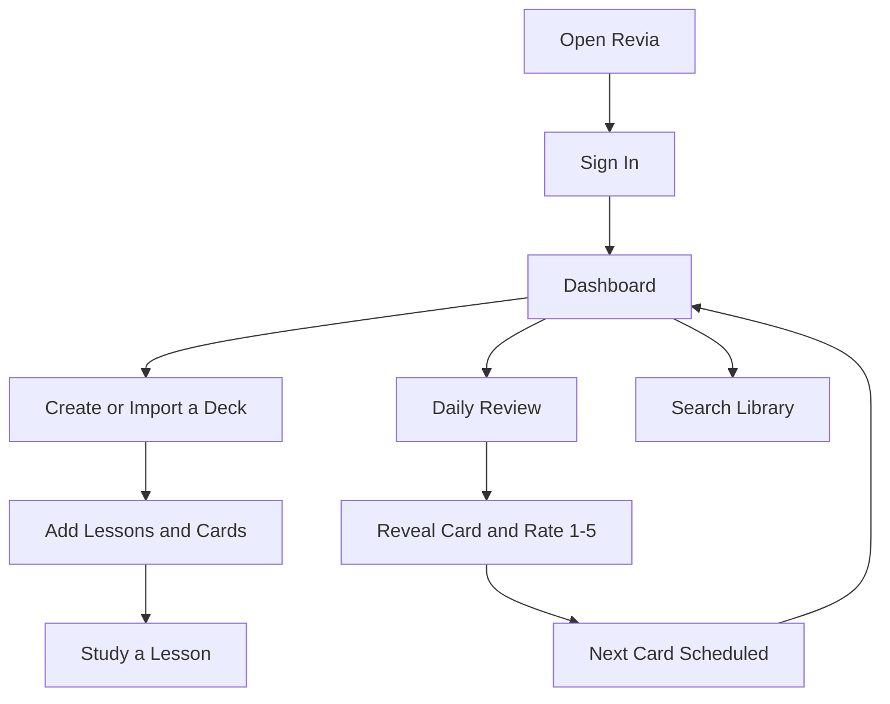
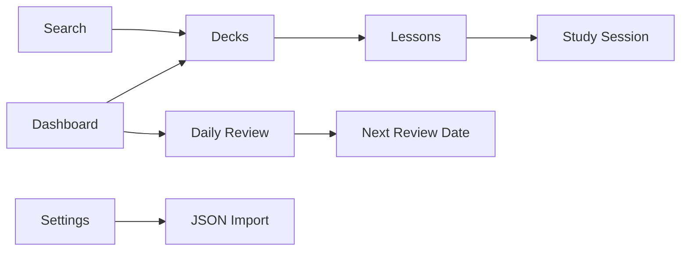

# Application Guide

## What This App Does

Revia is a mobile-first app for learning and remembering information with digital flashcards.

You organize study material into **decks**, split decks into **lessons**, and add **cards** with a front (question or prompt) and back (answer). The app schedules when each card should come back for review, so you spend time on what you still need to learn.

Revia works for any subject — languages, exams, interview prep, professional knowledge, or anything that fits on a flashcard.

## Who This Is For

Personal learners who want a simple daily study habit on their phone:

- Students reviewing definitions or concepts
- Language learners practicing vocabulary
- Professionals keeping key facts fresh
- Anyone who prefers small, focused review sessions over long study blocks

Version 1 is for **personal use only** — no sharing, collaboration, or public decks.

## The Problem It Solves

Reading something once is not enough to remember it. Reviewing everything every day is tiring.

Revia uses **spaced repetition**: cards you find easy appear less often; cards you struggle with come back sooner. You review what matters, when it matters.

## Main Things You Can Do

In v1 you can:

- **Sign up and sign in** with email and password
- **View your dashboard** — cards due today, streak, decks, recent activity
- **Create and manage decks** — topic containers with color and subject
- **Add lessons** inside a deck and **study** them (swipe through cards, normal or reverse mode)
- **Run daily review** — rate each card 1–5 after revealing the answer
- **Import decks** from JSON (file upload or paste) in Settings
- **Search** decks, lessons, and cards
- **Switch theme** (light/dark) and **sign out** in Settings

## How The App Works

Three levels of organization:

1. **Deck** — big topic (e.g. "Spanish Basics")
2. **Lesson** — section inside a deck (e.g. "Greetings")
3. **Card** — one item to learn (front: "Hola" → back: "Hello")

When you rate a card during review, the app updates its schedule. Cards due today appear on the dashboard and in the Review tab.

## User Journey Diagram

## Feature Map

## Important Terms

| Term | Meaning |
|------|---------|
| **Deck** | A collection for one topic or goal |
| **Lesson** | A section inside a deck |
| **Card** | A flashcard with front and back |
| **Due card** | Ready to review today |
| **Review** | Session where you reveal and rate cards |
| **Rating (1–5)** | How well you remembered (1 = forgot, 5 = perfect) |
| **Spaced repetition** | Showing cards at intervals based on difficulty |
| **Streak** | Consecutive days with at least one review |

## What Is Available Now (v1)

- Dashboard with due count, reviewed today, streak, deck/card totals
- Deck list, create, delete, and detail view
- Lessons: create, delete, tap to study with swipe navigation
- Daily review with full-screen card viewer and 1–5 ratings
- JSON deck import (Settings)
- Search across your library
- Light/dark theme
- Account sign-in, sign-up, and sign-out
- Live deployment at [revialearn.vercel.app](https://revialearn.vercel.app)

## What Is Coming Later

These are **candidates for future versions** — not committed until you review and approve:

- Edit deck title, description, and color in the UI
- Reorder and rename lessons
- Add and edit cards directly on the deck page (API exists today)
- Export decks as JSON
- Statistics page with charts and history
- Tags for organizing decks and cards
- Image and audio on cards
- More import formats (CSV, Markdown, etc.)
- Optional admin tools and roles

See [progress-and-roadmap.md](./progress-and-roadmap.md) for the full phased plan.

## Current App Status In One Sentence

**Revia v1 is a stable personal learning app: import or build content, study lessons, complete daily reviews, and track progress on your phone.**
