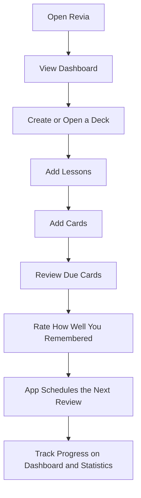
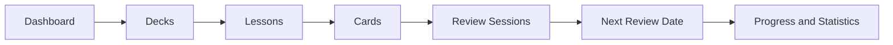

# Application Guide

## What This App Does

Revia is an app for learning and remembering information with digital flashcards.

You create a deck for a topic, split that deck into lessons, and add cards with a front side and a back side. The app is being built to show cards again at the right time, so users can remember more with less repeated effort.

The app is intentionally subject-neutral. It can be used for languages, school subjects, interview preparation, professional learning, or any topic that can be broken into reviewable cards.

## Who This Is For

This app is for learners who want a structured way to study over time.

Examples:

- A student learning biology definitions.
- A developer preparing for technical interviews.
- A language learner practicing vocabulary.
- A professional remembering concepts, policies, or procedures.
- Anyone who wants to organize knowledge into small review cards.

## The Problem It Solves

People forget information when they only read it once. Reviewing everything every day is also tiring and inefficient.

Revia solves this by organizing study material into small cards and preparing the foundation for spaced repetition. Spaced repetition means the app shows cards more often when they are new or difficult, and less often when they become familiar.

## Main Things You Can Do

Today, the app lets a user:

- View a dashboard with study counts and recent decks.
- Create decks for different topics.
- Open a deck and see its details.
- Add lessons inside a deck.
- Add cards inside a deck.
- Assign cards to lessons.
- Edit or delete cards.
- See which cards are due for review based on scheduling data.

Some parts are still coming later, especially the actual review session flow where users answer cards and rate how well they remembered them.

## How The App Works

Think of the app as three simple levels:

1. Decks are the big topic containers.
2. Lessons are sections inside a deck.
3. Cards are the actual things you study.

For example:

- Deck: Spanish Basics
- Lesson: Greetings
- Card front: Hola
- Card back: Hello

The app stores each card with scheduling information. When the Review feature is completed, that scheduling information will decide when each card should appear again.

## User Journey Diagram

This diagram shows the intended learning journey from opening the app to reviewing and tracking progress.

The first parts of this journey are available now: dashboard, decks, lessons, and cards. Review and detailed statistics are planned next.

## Feature Map

The app is built around a simple idea: organize what you want to learn, study it as cards, and let the system help decide when to review again.

## Important Terms

Deck: A collection for one topic or learning goal.

Lesson: A smaller section inside a deck.

Card: A flashcard with a front and back side.

Front: The question, prompt, word, or clue.

Back: The answer, explanation, or meaning.

Due card: A card that is ready to be reviewed.

Review: The process of answering a card and rating how well you remembered it.

Spaced repetition: A learning method where easier cards appear less often and harder cards appear more often.

Scheduler: The part of the app that decides the next review date for a card.

Suspended card: A card that is kept in the app but temporarily excluded from study.

## What Is Available Now

The following parts are implemented in the app:

- Dashboard page with study summary cards and recent decks.
- Deck list page.
- Deck creation.
- Deck detail page.
- Lesson creation, listing, and deletion.
- Card creation, listing, editing, deletion, lesson assignment, and suspension.
- Automatic initial scheduling state when a card is created.
- Demo data with a "Getting Started" deck, one lesson, and three cards.

## What Is Coming Later

The next major feature is Review.

Review will let users:

- Start a study session.
- See due cards one at a time.
- Flip a card to reveal the answer.
- Rate memory from "forgot" to "perfect".
- Let the app calculate the next review date.
- Update dashboard and statistics based on real review activity.

After Review, planned areas include:

- Statistics charts and learning history.
- Settings for learning preferences.
- Search across decks and cards.
- Tags for organizing decks and cards.
- Real user accounts instead of the current demo user.

## Current App Status In One Sentence

Revia can organize study content today, and the next step is to make the actual review loop usable.
