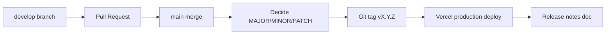

# Release Versioning

**Policy owner:** You (product)  
**Standard:** [Semantic Versioning 2.0.0](https://semver.org/) (`MAJOR.MINOR.PATCH`)  
**Current release:** **v1.4.0** — Practice mode & Daily Review split  
**Trigger:** Every merge to `main` that ships to production is a new version.

---

## Version format

```text
vMAJOR.MINOR.PATCH
```

Examples: `v1.0.0`, `v1.1.0`, `v1.0.1`, `v2.0.0`

| Part | When to bump | Examples for Revia |
|------|----------------|-------------------|
| **MAJOR** | Breaking changes users or integrators must act on | Auth provider swap requiring re-login; API response shape breaks clients; Prisma migration that drops/renames columns without automatic backfill; removing a page users rely on |
| **MINOR** | New features, backward compatible | Card edit UI; export; statistics page; tags; new import format |
| **PATCH** | Fixes and small improvements, no new features | Bug fixes; mobile performance; copy/UI polish; doc-only repo changes that don't change app behavior |

**Pre-release labels** (optional, rarely needed): `v1.1.0-beta.1` for long-running preview-only work on `develop`.

---

## What to name the current version

| Name | Use when |
|------|----------|
| **v1.0.0** | Official semver tag — use in git, release notes, changelog |
| "v1" or "Version 1" | Casual / marketing shorthand only |
| "v1.0 stable baseline" | Internal doc language (maps to **v1.0.0**) |

**Recommendation:** Tag git and write release notes as **`v1.0.0`**. Retire informal "v1 baseline" in favor of semver going forward.

---

## Main branch = new version



### On every `main` merge that goes to production

1. **Classify** the change (major / minor / patch) using the table above.
2. **Bump** version number (only one segment per release; reset lower segments to 0 when bumping higher).
3. **Tag** git: `git tag v1.1.0` (annotated tag recommended).
4. **Add** release notes file: `docs/releases/v1.1.0.md`.
5. **Update** [CHANGELOG.md](../../CHANGELOG.md) with one-line summary + link.
6. **Publish** release docs only when you explicitly ask (see below).

### When `main` has multiple small merges

You may **batch** patch releases (e.g. three bugfix merges → one `v1.0.1`) or release each merge as its own patch — your choice. Default for a solo project: **one version per meaningful main merge**; batch only same-day trivial fixes.

---

## How to decide: worked examples

| Change | Version bump |
|--------|----------------|
| Fix review button lag (optimistic UI) | **PATCH** `v1.0.1` |
| Vercel region `bom1` only | **PATCH** `v1.0.1` |
| Add deck edit form | **MINOR** `v1.1.0` |
| Add JSON export | **MINOR** `v1.2.0` |
| Add statistics page | **MINOR** `v1.3.0` |
| Change rating scale from 1–5 to 1–4 | **MAJOR** `v2.0.0` |
| Replace Supabase with another auth provider | **MAJOR** `v2.0.0` |
| Docs-only update in repo | **No app version** (or PATCH if you version docs with app) |

**Rule of thumb:** If existing users can keep using the app without noticing a breaking workflow change → MINOR or PATCH. If they must migrate, re-auth, or lose data shape → MAJOR.

---

## Release documentation

### File layout

```text
revia/
  CHANGELOG.md                 # Cumulative, newest first
  docs/
    application/
      release-versioning.md    # This policy
    releases/
      v1.0.0.md                # Per-version notes
      v1.1.0.md                # Created when that version ships
```

### Release note status

| Status | Meaning |
|--------|---------|
| **Draft** | Written in repo; not announced |
| **Published** | You asked to publish — e.g. GitHub Release, shared link, marked in doc header |

**You control publishing.** The agent writes/updates draft release docs in `docs/releases/`. Publishing to GitHub Releases or external channels happens **only when you say** (e.g. "publish v1.0.0 release notes").

### Release note template

Each `docs/releases/vX.Y.Z.md` should include:

- Version and date
- Status (Draft / Published)
- Summary (1–2 sentences)
- Added / Changed / Fixed / Breaking
- Deploy URL
- Migration notes (if any)

---

## Git tagging (standard practice)

```bash
# After main merge, from repo root
git tag -a v1.1.0 -m "v1.1.0: deck and card editing UI"
git push origin v1.1.0
```

Tags mark the exact commit deployed to production. Vercel production deploys should correspond to tagged commits when possible.

---

## Roadmap mapped to releases (proposed)

Use this to plan features by version. **Adjust when you review** — nothing ships until you approve.

| Target version | Type | Planned scope | Roadmap phase |
|----------------|------|---------------|---------------|
| **v1.0.0** – **v1.3.0** | MINOR | Core app through import & feedback | Shipped ✅ |
| **v1.4.0** | MINOR | Practice mode, Daily Review split | Shipped ✅ |
| **v1.5.0** | MINOR | Deck edit, lesson rename/reorder, card UI on deck page | Phase A |
| **v1.6.0** | MINOR | JSON export (deck + library) | Phase B |
| **v1.7.0** | MINOR | Statistics page, review charts | Phase C |
| **v1.8.0** | MINOR | Tags API + UI | Phase D |
| **v1.9.0** | MINOR | Image/audio on cards (Supabase Storage) | Phase E |
| **v2.0.0** | MINOR | CSV import, review deck filter | Phase F + G (subset) |
| **v2.1.0** | MAJOR | Roles/admin, breaking API changes, native app API contract | Phase H / I |

Versions can be **merged or split** (e.g. export + statistics in one `v1.2.0`) based on what you ship in a single main merge.

---

## `develop` vs `main`

| Branch | Versioning |
|--------|------------|
| `develop` | Preview deploys only — **no** semver tag unless you explicitly pre-release |
| `main` | Production — **always** bump version when merging shippable work |

Feature work happens on `develop` (or feature branches → PR → `develop` → PR → `main`). Version tag applies at **`main`**.

---

## package.json version (optional)

`package.json` `"version"` can mirror semver (`"1.0.0"`). Update it when tagging if you want npm-style consistency. Not required for Vercel deploys.

---

## Agent workflow (from now on)

1. Implement approved features on `develop`.
2. On merge to `main`, propose version bump + draft `docs/releases/vX.Y.Z.md`.
3. Update `CHANGELOG.md`.
4. **Do not** publish GitHub Release or announce until you say "publish release notes for vX.Y.Z".
5. Map new feature requests to a **target version** in [progress-and-roadmap.md](./progress-and-roadmap.md).

---

## Related docs

- [v1.0.0 release notes](../releases/v1.0.0.md)
- [Progress & Roadmap](./progress-and-roadmap.md)
- [CHANGELOG.md](../../CHANGELOG.md)
