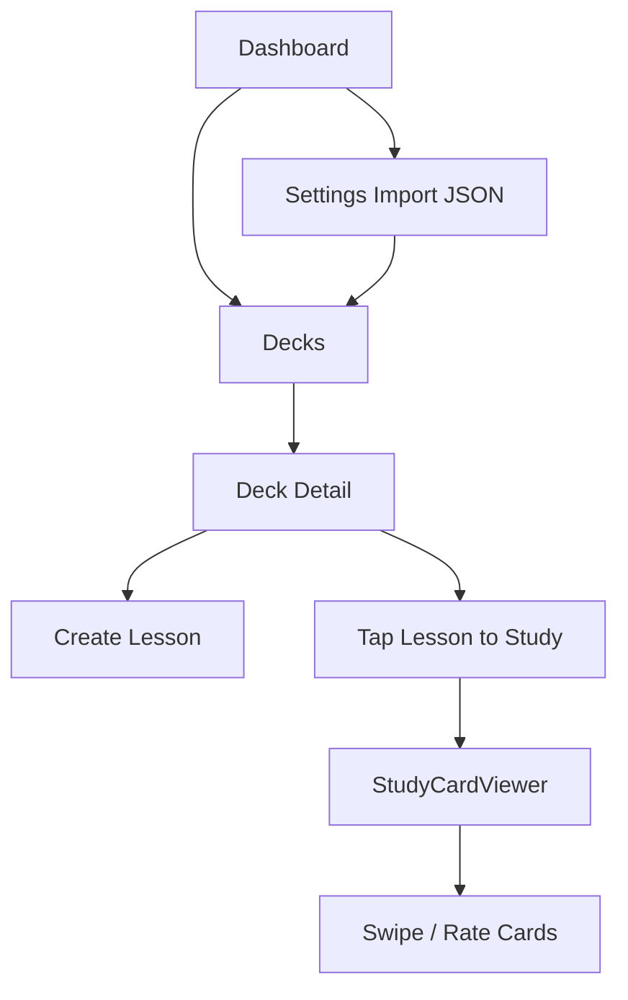
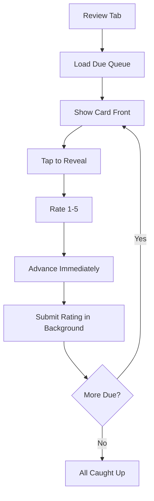
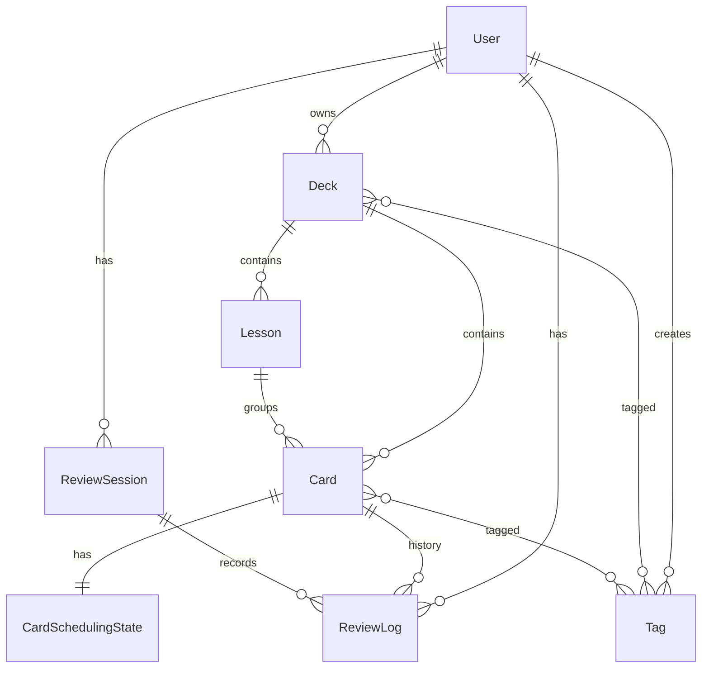
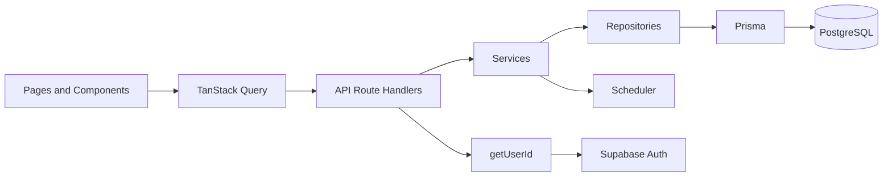

# Technical Reference

## Application Overview

Revia is a subject-agnostic spaced repetition learning platform.

**Product model:**

```text
User → Deck → Lesson → Card → Scheduling State → Review Log
```

**v1 status:** Core loop is complete — content management, lesson study, daily review, dashboard, search, import, and Supabase auth are implemented and deployed.

**Architecture pattern:**

```text
Pages/Components → TanStack Query Hooks → API Route Handlers
  → Services → Repositories → Prisma → PostgreSQL
```

## Tech Stack

| Layer | Technology |
|-------|------------|
| Framework | Next.js 15 (App Router) |
| UI | React 19, TypeScript, Tailwind CSS 4, shadcn/ui |
| Forms | React Hook Form + Zod |
| Client state | TanStack Query |
| Auth | Supabase (`@supabase/ssr`) |
| ORM | Prisma 6 |
| Database | PostgreSQL (local Docker or Supabase) |
| Scheduler | Pure TypeScript (`src/lib/scheduler/`) |
| Unit tests | Vitest |
| E2E tests | Playwright (iPhone 13 viewport) |
| Deploy | Vercel (`bom1` Mumbai) |

## Feature Status (v1)

| Feature | Status | Notes |
|---------|--------|-------|
| Dashboard | Complete | Stats, recent decks, review CTA |
| Decks | Complete | List, create, delete, detail; PATCH API without edit UI |
| Lessons | Complete | Create, delete, study viewer; PATCH API without edit UI |
| Review | Complete | Due queue, ratings, `simple-v1` scheduler, optimistic UI |
| Explore | Complete | Library search + public decks (`/explore`) |
| Settings | Complete | Theme, import, create deck, account, about |
| Import | Complete | JSON/text via `POST /api/import/deck` |
| Auth | Complete | Supabase email/password; mock user fallback locally |
| Cards CRUD | Partial | Full API; `CardsSection` not mounted on deck page |
| Tags | Partial | Prisma + import; no UI or tag API routes |
| Export | Planned | — |
| Statistics | Planned | Dashboard counts only; no `/statistics` page |
| Media upload | Planned | `imageUrl`/`audioUrl` on schema only |
| Admin / roles | Planned | — |

## Folder Structure

```text
revia/
  src/
    app/                    Pages, API routes, auth callback
      (app)/                Protected app routes (mobile shell)
      api/                  REST JSON endpoints
      auth/callback/        Supabase OAuth/code exchange
    components/             Shared UI, layout, providers
    features/               Per-feature UI, hooks, API clients
      auth/                 Login, signup, account settings
      cards/                Card hooks and forms (not on deck page yet)
      dashboard/
      decks/
      import/
      lessons/
      review/
      search/
      settings/
      study/                StudyCardViewer (shared by review + lessons)
    lib/
      api/                  auth.ts, response.ts
      db/                   Prisma client
      repositories/         Database access
      services/             Business logic
      scheduler/            Pure SRS algorithm
      validators/           Zod schemas
      supabase/             Client, server, middleware
      query/                Prefetch helpers
    types/                  Shared TypeScript types
  prisma/schema.prisma
  tests/unit/               Vitest
  tests/e2e/                Playwright
  docs/                     All documentation
```

## User Flows

### Content + Study Flow (implemented)



### Review Flow (implemented)



Optimistic advance: UI moves to the next card before the API responds. See `review-page-content.tsx`.

## API Documentation

**Response envelope:**

```json
{ "data": { ... } }
```

**Error envelope:**

```json
{ "error": { "code": "VALIDATION", "message": "...", "field": "optional" } }
```

All data routes call `getUserId()` from `src/lib/api/auth.ts` (Supabase session or `MOCK_USER_ID`).

### Endpoints

| Method | Path | Purpose |
|--------|------|---------|
| GET | `/api/health` | App + DB health |
| GET | `/api/dashboard` | Summary stats + 5 recent decks |
| GET | `/api/decks` | List decks with card/due counts |
| POST | `/api/decks` | Create deck |
| GET/PATCH/DELETE | `/api/decks/:deckId` | Deck CRUD (PATCH supports `isPublic`; GET allows public read) |
| POST | `/api/decks/:deckId/import` | Import public deck into your library |
| GET/POST | `/api/decks/:deckId/lessons` | List/create lessons |
| GET/PATCH/DELETE | `/api/decks/:deckId/lessons/:lessonId` | Lesson CRUD |
| GET/POST | `/api/decks/:deckId/cards` | List/create cards (`?lessonId=` filter) |
| GET/PATCH/DELETE | `/api/decks/:deckId/cards/:cardId` | Card CRUD |
| GET | `/api/review/due` | Due queue (`deckId`, `limit` query) |
| POST | `/api/review` | Submit rating, update scheduling |
| GET | `/api/search` | Search your library (`q`, `limit`) |
| GET | `/api/explore` | List public decks (`q`, `limit`) |
| GET/PATCH/POST | `/api/account` | Profile, username update, account sync |
| GET | `/api/auth/resolve-email` | Resolve username → email for login |
| POST | `/api/feedback` | Submit suggestion or bug report |
| POST | `/api/import/deck` | Import JSON deck |
| GET | `/auth/callback` | Supabase session + Prisma user sync |

### Review submit body

```json
{
  "cardId": "uuid",
  "rating": 3,
  "durationMs": 4500
}
```

Ratings: 1 (forgot) through 5 (perfect). Scheduler: `SimpleIntervalAlgorithm` (`simple-v1`).

## Data Model



Schema: `prisma/schema.prisma`

## Architecture



**Layer rules:**

- Route handlers: parse, validate (Zod), call service, return JSON
- Services: business rules, ownership checks
- Repositories: Prisma only, map dates to ISO strings
- Scheduler: zero imports from React, Next.js, or Prisma
- Features: HTTP clients + hooks + UI only

## Auth

| Mode | When | Behavior |
|------|------|----------|
| Supabase | `NEXT_PUBLIC_SUPABASE_URL` + anon key set | Email/password; middleware protects pages |
| Mock user | Supabase env unset | `MOCK_USER_ID` from `.env` |

- Middleware: `getSession()` on pages only; API routes skip middleware auth
- Callback: `userRepository.ensureUser()` syncs Prisma user on first login
- API: `getUserId()` uses cached `getSession()` — no DB sync on hot path

## State Management

**TanStack Query** (`query-provider.tsx`):

- Default `staleTime`: 60s, `gcTime`: 10min
- Dashboard: 2min, Decks: 5min, Review due: 30s
- Prefetch on app shell mount and nav tap (`prefetch-app-data.ts`)

**Forms:** React Hook Form + shared Zod schemas from `src/lib/validators/`.

## Deployment

| Setting | Value |
|---------|-------|
| Vercel Root Directory | `revia` (required) |
| Function region | `bom1` (Mumbai) — `vercel.json` |
| Supabase region | `ap-south-1` |
| Production URL | `https://revialearn.vercel.app` |
| Production branch | `main` |
| Preview branch | `develop` (recommended) |

Full guide: [DEPLOY-VERCEL.md](../DEPLOY-VERCEL.md)

**Required env vars:**

- `DATABASE_URL` — pooler port 6543 + `pgbouncer=true`
- `DIRECT_URL` — port 5432 for migrations
- `NEXT_PUBLIC_SUPABASE_URL`
- `NEXT_PUBLIC_SUPABASE_ANON_KEY`

## Local Development

```bash
cd revia
npm run setup    # Docker Postgres + schema + seed
npm run dev      # http://localhost:3000
```

Without Supabase env vars, the app uses the mock user (no login required).

**Useful commands:**

| Command | Purpose |
|---------|---------|
| `npm run check` | typecheck + test + build |
| `npm run test` | Vitest unit tests |
| `npm run test:e2e` | Playwright E2E |
| `npm run db:studio` | Prisma Studio |
| `npm run supabase:connect` | Configure Supabase auth URLs |
| `npm run vercel:setup` | Print Vercel + Supabase env template |

## Testing

| Type | Location | Run |
|------|----------|-----|
| Unit | `tests/unit/lib/scheduler/` | `npm run test` |
| E2E | `tests/e2e/*.spec.ts` | `npm run test:e2e` |
| Full CI | — | `npm run check` |

E2E specs: health, navigation, decks, review, theme.

## Performance (v1)

- Optimistic review UI (instant card advance)
- Vercel `bom1` + Supabase `ap-south-1` co-location
- No review history fetch on submit (algorithm uses state only)
- Dashboard: 5-deck limit, distinct-day streak SQL
- Lesson cards: `?lessonId=` scoped fetch
- Deferred cache invalidation during review sessions
- Prisma client reused across warm serverless invocations

## Future Work

See [progress-and-roadmap.md](./progress-and-roadmap.md) for phased candidates. High-level gaps:

1. Card management UI on deck detail page
2. Deck and lesson edit/reorder UI
3. Export (JSON)
4. Statistics / charts page
5. Tags UI and API
6. Media upload for cards
7. Additional import formats
8. Admin tools and roles (optional)

**Do not implement roadmap items without explicit approval** — v1 is the stable baseline for incremental changes.
