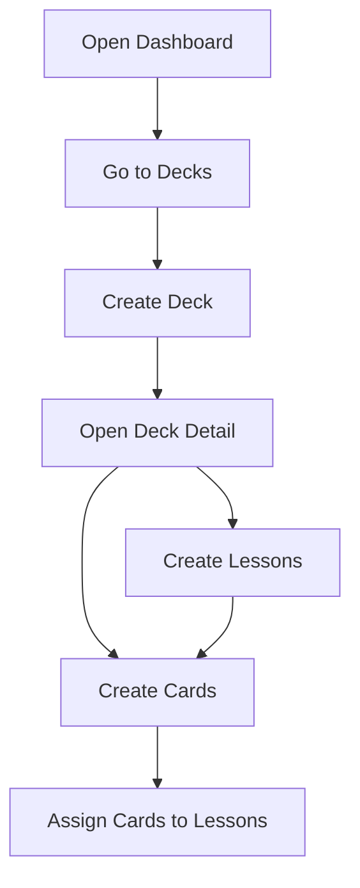
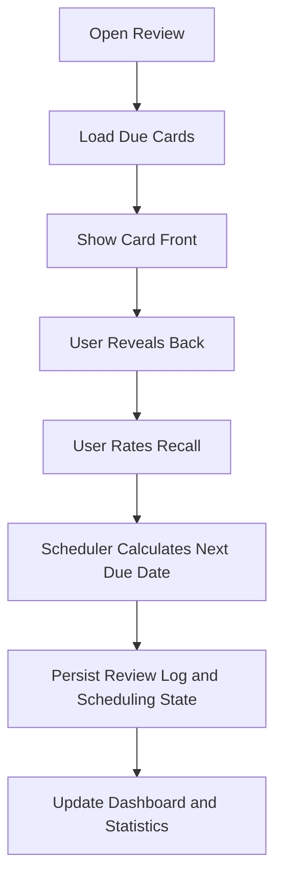
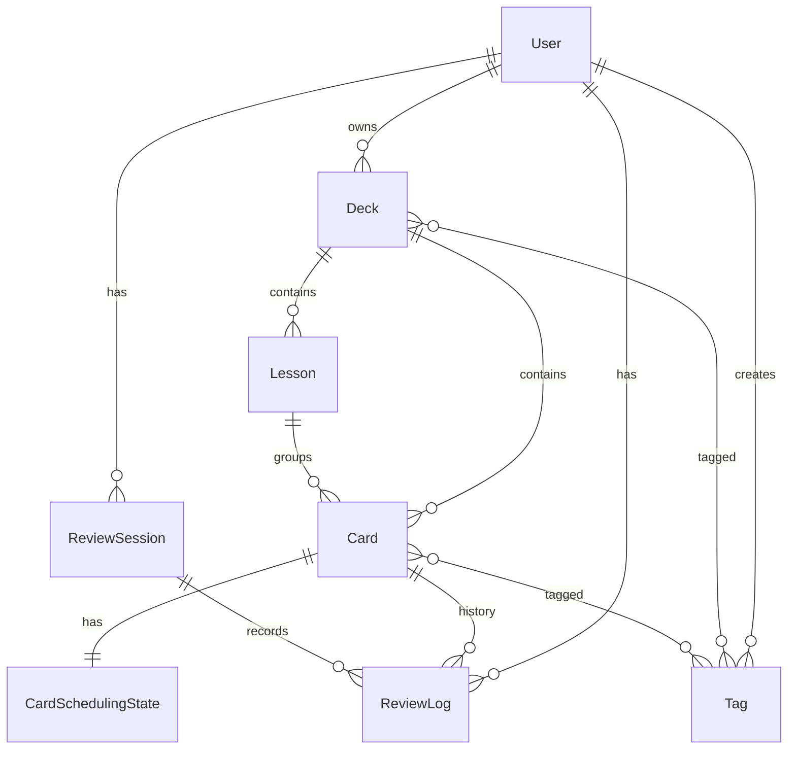
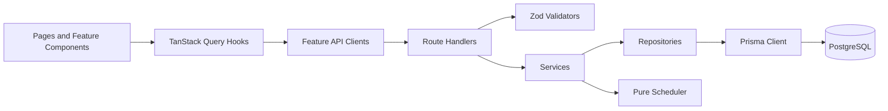

# Technical Reference

## Application Overview

Revia is a subject-agnostic spaced repetition learning platform.

The product model is:

```text
User -> Deck -> Lesson -> Card -> Scheduling State -> Review History
```

The app currently supports the content-management foundation: dashboard, decks, lessons, and cards. The scheduler exists as pure TypeScript and is used to create initial card scheduling state. The full review loop is planned next.

## Tech Stack

- Next.js 15 with App Router and Turbopack development server.
- React 19.
- TypeScript.
- Tailwind CSS 4.
- shadcn/ui style shared components.
- React Hook Form for forms.
- Zod for shared API and form validation.
- TanStack Query for client-side server state.
- Prisma ORM.
- PostgreSQL.
- Vitest for unit tests.
- Mock user authentication for MVP development.

Important package and script references:

- `package.json`
- `src/lib/api/auth.ts`
- `src/lib/api/response.ts`
- `src/components/providers/query-provider.tsx`

## Feature Status

This status is based on the current source code, not only the older architecture docs.

| Feature | Status | Notes |
|---|---|---|
| Dashboard | Partial | `/dashboard` and `/api/dashboard` work, but review-dependent stats stay limited until Review exists. |
| Decks | Complete | API CRUD, deck list UI, create UI, delete UI, detail page. PATCH API exists; edit UI is not yet exposed. |
| Lessons | Partial | API CRUD, list/create/delete UI in deck detail. Update hook/API exists; edit/reorder UI is not yet exposed. |
| Cards | Partial | API CRUD, list/create/edit/delete UI, lesson assignment, suspension, initial scheduling state. Tags/media upload are not built. |
| Review | Planned | Page placeholder only. Scheduler exists, but review sessions and ratings are not wired yet. |
| Statistics | Planned | Page placeholder only. Dashboard has basic stats queries. |
| Settings | Planned | Page placeholder only. |
| Search | Planned | Page placeholder exists, no search API or UI flow yet. |
| Tags | Planned | Database schema exists, no app feature yet. |

## Folder Structure

The app uses an API-first, feature-based structure.

```text
src/
  app/              Pages and API route handlers
  components/       Shared UI, layout, providers
  features/         Feature UI, hooks, HTTP clients
  lib/              Services, repositories, validators, scheduler, DB
  types/            Shared TypeScript response and domain types
```

Main implementation paths:

- `src/app/(app)/dashboard/page.tsx`
- `src/app/(app)/decks/page.tsx`
- `src/app/(app)/decks/[deckId]/page.tsx`
- `src/features/dashboard/`
- `src/features/decks/`
- `src/features/lessons/`
- `src/features/cards/`
- `src/lib/services/`
- `src/lib/repositories/`
- `src/lib/validators/`
- `src/lib/scheduler/`
- `prisma/schema.prisma`

## User Flows

### Content Creation Flow



This flow is implemented today.

### Planned Review Flow



This is the next core product milestone. The scheduler and database models exist, but the route handlers, service, repository, and UI flow still need implementation.

## API Documentation

All implemented API endpoints use the standard response envelope:

```json
{ "data": "..." }
```

Errors use:

```json
{ "error": { "code": "VALIDATION", "message": "Message", "field": "optionalField" } }
```

The response helpers live in `src/lib/api/response.ts`.

### Health

| Method | Path | Purpose |
|---|---|---|
| GET | `/api/health` | Checks app and database health. |

### Dashboard

| Method | Path | Purpose |
|---|---|---|
| GET | `/api/dashboard` | Returns due count, reviewed today, streak, total cards, mature cards, deck count, and recent decks. |

Implementation:

- Handler: `src/app/api/dashboard/route.ts`
- Service: `src/lib/services/dashboard.service.ts`
- Repository: `src/lib/repositories/stats.repository.ts`

### Decks

| Method | Path | Purpose |
|---|---|---|
| GET | `/api/decks` | List active decks for the current user. |
| POST | `/api/decks` | Create a deck. |
| GET | `/api/decks/:deckId` | Get one deck. |
| PATCH | `/api/decks/:deckId` | Update one deck. |
| DELETE | `/api/decks/:deckId` | Delete one deck. |

POST body:

```json
{
  "title": "Spanish Basics",
  "description": "Beginner vocabulary",
  "subject": "Spanish",
  "color": "#6366f1"
}
```

Implementation:

- Handlers: `src/app/api/decks/route.ts`, `src/app/api/decks/[deckId]/route.ts`
- Service: `src/lib/services/deck.service.ts`
- Repository: `src/lib/repositories/deck.repository.ts`
- Validator: `src/lib/validators/deck.schema.ts`

### Lessons

| Method | Path | Purpose |
|---|---|---|
| GET | `/api/decks/:deckId/lessons` | List lessons in a deck. |
| POST | `/api/decks/:deckId/lessons` | Create a lesson in a deck. |
| GET | `/api/decks/:deckId/lessons/:lessonId` | Get one lesson. |
| PATCH | `/api/decks/:deckId/lessons/:lessonId` | Update one lesson. |
| DELETE | `/api/decks/:deckId/lessons/:lessonId` | Delete one lesson. |

POST body:

```json
{
  "title": "Greetings",
  "sortOrder": 0
}
```

Important rule: lesson operations first verify the deck belongs to the current user.

Implementation:

- Handlers: `src/app/api/decks/[deckId]/lessons/route.ts`, `src/app/api/decks/[deckId]/lessons/[lessonId]/route.ts`
- Service: `src/lib/services/lesson.service.ts`
- Repository: `src/lib/repositories/lesson.repository.ts`
- Validator: `src/lib/validators/lesson.schema.ts`

### Cards

| Method | Path | Purpose |
|---|---|---|
| GET | `/api/decks/:deckId/cards` | List cards in a deck. |
| POST | `/api/decks/:deckId/cards` | Create a card and its initial scheduling state. |
| GET | `/api/decks/:deckId/cards/:cardId` | Get one card. |
| PATCH | `/api/decks/:deckId/cards/:cardId` | Update one card. |
| DELETE | `/api/decks/:deckId/cards/:cardId` | Delete one card. |

POST body:

```json
{
  "lessonId": "optional-lesson-id",
  "front": "Hola",
  "back": "Hello",
  "pronunciation": "oh-lah",
  "exampleSentence": "Hola, buenos dias.",
  "notes": "Common greeting",
  "imageUrl": null,
  "audioUrl": null
}
```

Important rules:

- Card operations first verify the deck belongs to the current user.
- If `lessonId` is provided, the lesson must belong to the same deck.
- Card creation calls `schedulingEngine.createInitialState()` before persistence.

Implementation:

- Handlers: `src/app/api/decks/[deckId]/cards/route.ts`, `src/app/api/decks/[deckId]/cards/[cardId]/route.ts`
- Service: `src/lib/services/card.service.ts`
- Repository: `src/lib/repositories/card.repository.ts`
- Validator: `src/lib/validators/card.schema.ts`
- Scheduler entry: `src/lib/scheduler/index.ts`

## Data Model

The Prisma schema is in `prisma/schema.prisma`.



Main entities:

- `User`: owns decks, tags, review sessions, and review logs.
- `Deck`: top-level study collection.
- `Lesson`: ordered group inside a deck.
- `Card`: study item with front and back text plus optional metadata.
- `CardSchedulingState`: one-to-one scheduling state for each card.
- `ReviewLog`: record of one review rating and scheduling change.
- `ReviewSession`: group of review events.
- `Tag`, `CardTag`, `DeckTag`: tagging schema, planned for future UI.

## Architecture



Layer rules:

- Route handlers stay thin: parse params/body, validate, call service, return JSON.
- Services contain business rules and orchestration.
- Repositories contain Prisma access and map database dates to ISO strings.
- Feature services are HTTP clients only.
- Feature components do not import Prisma or scheduler code.
- Scheduler is pure TypeScript and does not import React, Next.js, or Prisma.

## State Management

Server state is managed with TanStack Query:

- `src/features/decks/hooks/use-decks.ts`
- `src/features/lessons/hooks/use-lessons.ts`
- `src/features/cards/hooks/use-cards.ts`
- `src/features/dashboard/hooks/use-dashboard.ts`

The provider is `src/components/providers/query-provider.tsx`.

Forms use React Hook Form with Zod schemas shared from `src/lib/validators/`.

Local UI state is kept close to components. For example, card inline edit mode uses local component state.

## Validation

Validation is shared between API routes and forms:

- `src/lib/validators/deck.schema.ts`
- `src/lib/validators/lesson.schema.ts`
- `src/lib/validators/card.schema.ts`

Route handlers parse request bodies with Zod before calling services. Forms use the same schema with `zodResolver`.

## Scheduler

The scheduler lives in `src/lib/scheduler/`.

Current implementation:

- `SchedulingEngine`
- `SimpleIntervalAlgorithm`
- Rating values from 1 to 5
- `createInitialState(cardId, now)`
- `submitReview(input)`

Current app usage:

- Card creation creates an initial scheduling state.
- Review submission is not wired yet.

Important design boundary: the scheduler does not know about decks, lessons, subjects, languages, or UI. It only receives scheduling state, review rating, review history, and current time.

## Local Development

From the project root:

```bash
cd /Users/pavan/Build/revia
npm run setup
npm run dev
```

Open:

```text
http://localhost:3000
```

If Docker is not available, Prisma Dev can be used for local PostgreSQL:

```bash
npx prisma dev -n revia -d
npm run db:push
npm run db:seed
npm run dev
```

Useful commands:

| Command | Purpose |
|---|---|
| `npm run setup` | Install dependencies, start local DB, push schema, seed data. |
| `npm run dev` | Start the development server. |
| `npm run check` | Run typecheck, unit tests, and production build. |
| `npm run test` | Run unit tests. |
| `npm run db:push` | Push Prisma schema to the database. |
| `npm run db:seed` | Seed demo data. |
| `npm run db:reset` | Reset and reseed the database. |
| `npm run db:studio` | Open Prisma Studio. |

## Testing

Current automated test coverage:

- `tests/unit/lib/scheduler/simple-interval.test.ts`

The full verification command is:

```bash
npm run check
```

Current testing gaps:

- API integration tests for decks, lessons, cards, and dashboard.
- Review-flow tests, once Review is implemented.
- End-to-end tests for the main learning journey.
- UI interaction tests for forms and inline card editing.

## Future Work

Near-term priorities:

1. Review feature: due-card queue, flip interaction, rating buttons, session tracking, review logs.
2. Statistics feature: charts and history based on review logs.
3. Settings feature: user preferences and future scheduler options.
4. Search feature: search across decks/cards.
5. Tagging feature: use existing tag schema for deck/card organization.
6. Auth: replace mock user with real user accounts and authorization.

Also update older status docs such as `README.md` and architecture rollout tables because they still mark some implemented features as planned.
