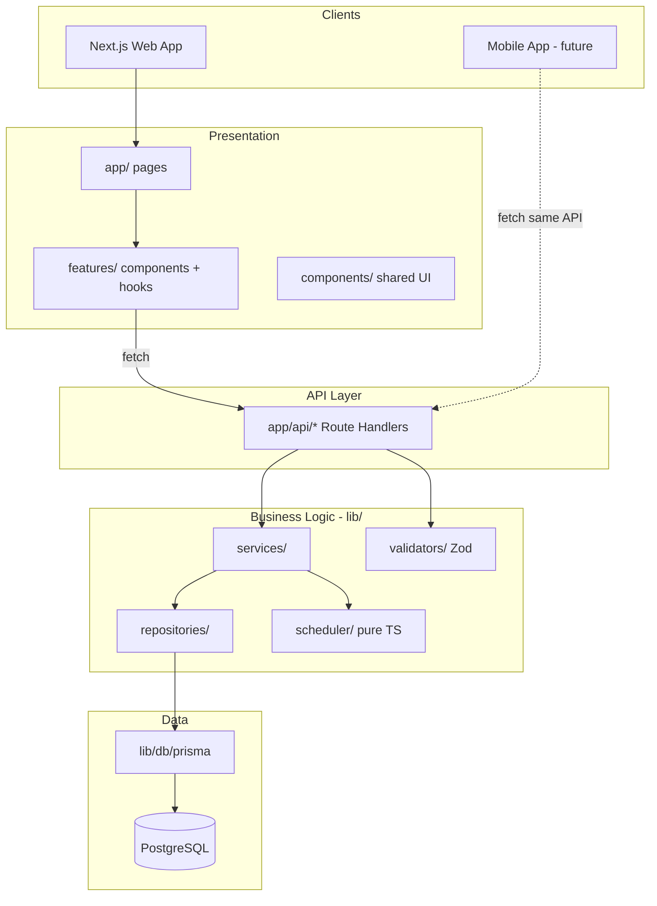

# 01 — System Overview (v2)

## Architecture Diagram



## Layer Responsibilities

| Layer | Location | Responsibility |
|-------|----------|----------------|
| **Pages** | `src/app/` | Routing, layout, compose feature components |
| **Features** | `src/features/` | Feature UI, hooks, API client, local types |
| **Components** | `src/components/` | Shared shadcn/ui, layout shell |
| **API** | `src/app/api/` | HTTP boundary: validate → call service → JSON response |
| **Services** | `src/lib/services/` | Business rules, orchestration |
| **Repositories** | `src/lib/repositories/` | Prisma data access, mapping |
| **Scheduler** | `src/lib/scheduler/` | Pure spaced repetition math |
| **Validators** | `src/lib/validators/` | Zod schemas (shared API + forms) |
| **Types** | `src/types/` | Cross-cutting TypeScript types |

## What Goes Where

| ✅ Belongs in | ❌ Never in |
|---------------|-------------|
| `lib/services` — business rules | React components |
| `lib/scheduler` — interval math | Route Handlers (beyond HTTP glue) |
| `lib/repositories` — DB queries | Server Actions (business logic) |
| `app/api` — HTTP in/out | `features/` (DB or scheduler imports) |
| `features/*/services` — fetch API | Prisma in feature folders |

## Mobile Strategy

The web app and future mobile apps are **thin clients**:

```
Mobile App  ──HTTP──►  /api/decks
                       /api/cards
                       /api/review
                              │
                              ▼
                       lib/services  ◄── same code web API uses
                              │
                              ▼
                       lib/repositories
```

No business logic duplication. Mobile adds only native UI + auth token header.

## API Design Conventions

- REST JSON under `/api/{resource}`
- Standard response envelope:

```typescript
// Success
{ "data": T }

// Error
{ "error": { "code": string, "message": string, "field?:": string } }
```

- Auth: `Authorization` header (future) / mock user in MVP
- Validation: Zod in Route Handler before service call

## Bounded Contexts

| Context | API prefix | Service |
|---------|------------|---------|
| Decks | `/api/decks` | `deckService` |
| Lessons | `/api/decks/:id/lessons` | `lessonService` |
| Cards | `/api/decks/:id/cards` | `cardService` |
| Review | `/api/review` | `reviewService` |
| Statistics | `/api/statistics` | `statsService` |
| Dashboard | `/api/dashboard` | aggregates stats + decks |

**Scheduling context** is subject-blind — `reviewService` calls `lib/scheduler` with state + rating only.

## Rating System (unchanged)

| Rating | Label | Effect |
|--------|-------|--------|
| 1 | Forgot Completely | Shortest interval |
| 2 | Hard | Short interval |
| 3 | Okay | Moderate |
| 4 | Good | Standard increase |
| 5 | Perfect | Longest interval |
