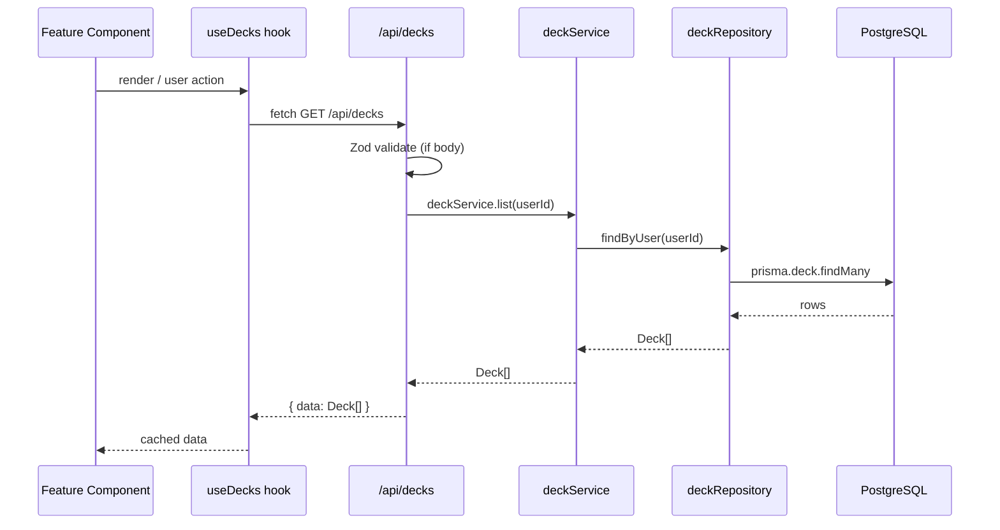
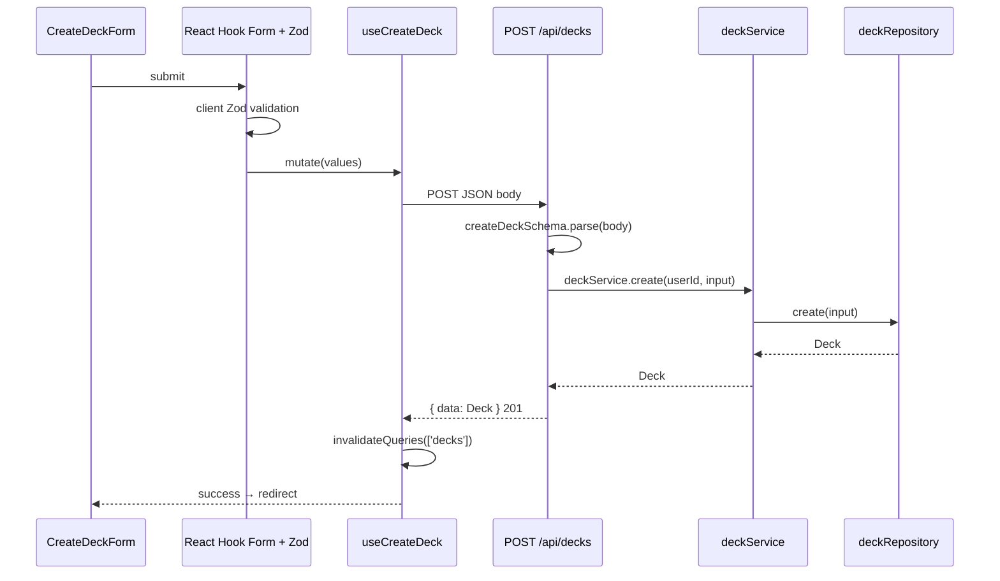
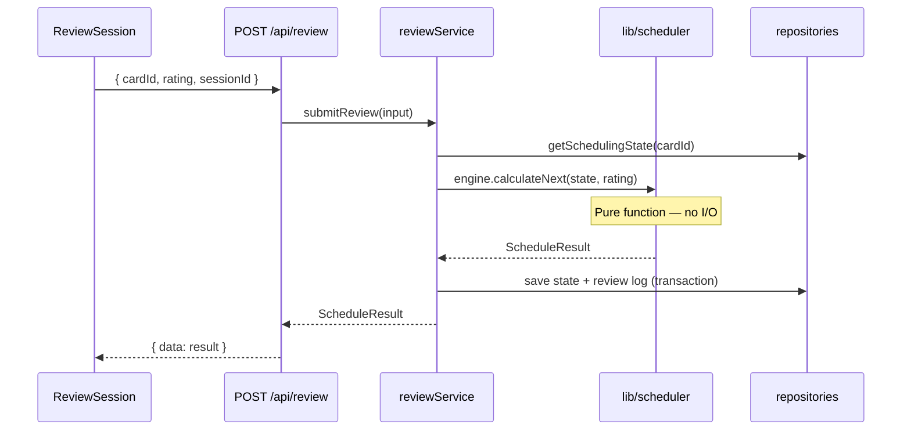
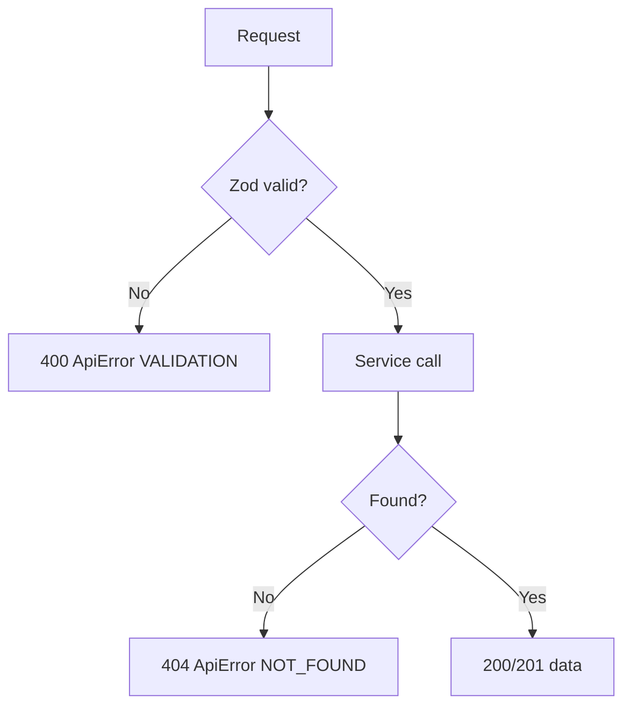

# 05 — Data Flow (v2)

## Standard Request Flow



## Create Deck Flow



## Review Submit Flow (planned)



## Error Flow



## Client vs Server State

| Data | Mechanism |
|------|-----------|
| Deck list | TanStack Query `useDecks()` |
| Create deck | `useMutation` → POST `/api/decks` |
| Form fields | React Hook Form local state |
| Review session | Feature hook `useReviewSession` (ephemeral) |
| Scheduler | Never on client — server only via API |

## Mobile Parity

Mobile app uses identical flows — only the UI layer differs:

```
Web:    CreateDeckForm → useCreateDeck → fetch('/api/decks')
Mobile: CreateDeckScreen → DeckRepository.create() → HTTP POST /api/decks
```

Both hit the same Route Handler and `deckService`.
